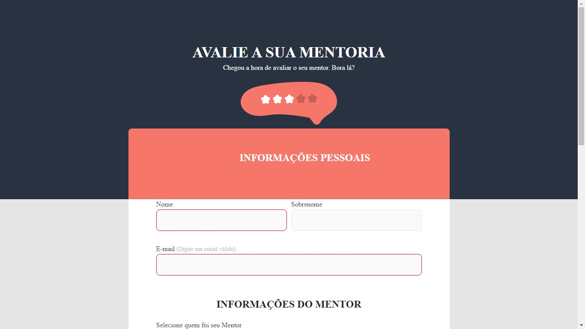

# Desafio Criando Formulários Avançado

Desafio do Stage03 que faz parte do Programa Explorer da Rocketseat  

## Screenshots

[🔗 Clique aqui para acessar o Projeto](https://fabiovascao.github.io/Projeto-03-Criando-Formularios-Avancado/)  
[🔗 Clique aqui para acessar o Figma](https://www.figma.com/file/zZujRIVdrGitVAEqCEM6CS/Stage-03-Formul%C3%A1rio-avan%C3%A7ado-Copy?fuid=1151137169943796805)

## 🛠 Tecnologias

- HTML
- CSS
- Git e Github

## Autor

- [@FabioVascão](https://www.github.com/fabiovascao)